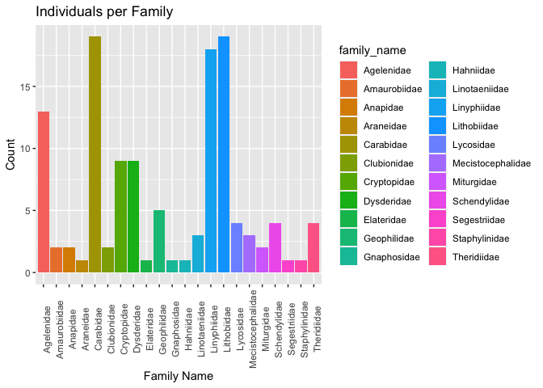
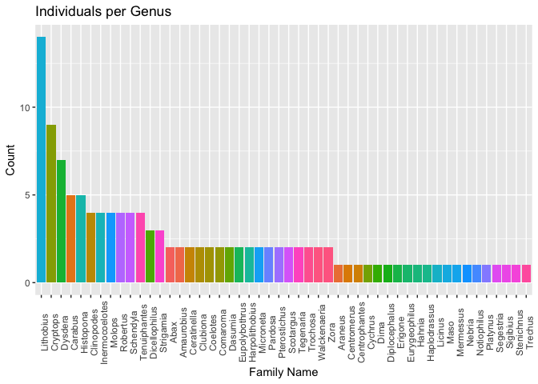

Data Inspection for Final Project
================
2022-04-20

First, I will load in the packages (tidyverse, lemon, knitr). This code
is in the script but not knit to the markdown document for readability.

I also read in the “DS-KROK4BDJ.txt” file, which is a tsv downloaded
from our paper of choice and (I believe) contains all the data we will
need to work with, including sample IDs, geographic information, and
sequences.

After reading in the file, I inspect the column dimensions

``` r
dim(bdj)
```

    ## [1] 124  80

There are 80 columns and 124 rows in this file. Next check out column
names.

``` r
print(column_names)
```

    ##  [1] "processid"                  "sampleid"                  
    ##  [3] "recordID"                   "catalognum"                
    ##  [5] "fieldnum"                   "institution_storing"       
    ##  [7] "collection_code"            "bin_uri"                   
    ##  [9] "phylum_taxID"               "phylum_name"               
    ## [11] "class_taxID"                "class_name"                
    ## [13] "order_taxID"                "order_name"                
    ## [15] "family_taxID"               "family_name"               
    ## [17] "subfamily_taxID"            "subfamily_name"            
    ## [19] "genus_taxID"                "genus_name"                
    ## [21] "species_taxID"              "species_name"              
    ## [23] "subspecies_taxID"           "subspecies_name"           
    ## [25] "identification_provided_by" "identification_method"     
    ## [27] "identification_reference"   "tax_note"                  
    ## [29] "voucher_status"             "tissue_type"               
    ## [31] "collection_event_id"        "collectors"                
    ## [33] "collectiondate_start"       "collectiondate_end"        
    ## [35] "collectiontime"             "collection_note"           
    ## [37] "site_code"                  "sampling_protocol"         
    ## [39] "lifestage"                  "sex"                       
    ## [41] "reproduction"               "habitat"                   
    ## [43] "associated_specimens"       "associated_taxa"           
    ## [45] "extrainfo"                  "notes"                     
    ## [47] "lat"                        "lon"                       
    ## [49] "coord_source"               "coord_accuracy"            
    ## [51] "elev"                       "depth"                     
    ## [53] "elev_accuracy"              "depth_accuracy"            
    ## [55] "country"                    "province_state"            
    ## [57] "region"                     "sector"                    
    ## [59] "exactsite"                  "image_ids"                 
    ## [61] "image_urls"                 "media_descriptors"         
    ## [63] "captions"                   "copyright_holders"         
    ## [65] "copyright_years"            "copyright_licenses"        
    ## [67] "copyright_institutions"     "photographers"             
    ## [69] "sequenceID"                 "markercode"                
    ## [71] "genbank_accession"          "nucleotides"               
    ## [73] "trace_ids"                  "trace_names"               
    ## [75] "trace_links"                "run_dates"                 
    ## [77] "sequencing_centers"         "directions"                
    ## [79] "seq_primers"                "marker_codes"

Let’s look at the first 5 rows in this file. It’s a large chunk, but
very interesting. Scroll side to side to see the whole chunk.

``` r
kable(bdj[1:5, ])
```

| processid  | sampleid | recordID | catalognum | fieldnum | institution_storing                           | collection_code | bin_uri      | phylum_taxID | phylum_name | class_taxID | class_name | order_taxID | order_name | family_taxID | family_name | subfamily_taxID | subfamily_name | genus_taxID | genus_name   | species_taxID | species_name             | subspecies_taxID | subspecies_name | identification_provided_by | identification_method | identification_reference | tax_note | voucher_status | tissue_type | collection_event_id | collectors                                                | collectiondate_start | collectiondate_end | collectiontime | collection_note | site_code | sampling_protocol   | lifestage | sex | reproduction | habitat              | associated_specimens | associated_taxa | extrainfo | notes |    lat |    lon | coord_source | coord_accuracy | elev | depth | elev_accuracy | depth_accuracy | country  | province_state | region   | sector | exactsite            | image_ids | image_urls | media_descriptors | captions | copyright_holders | copyright_years | copyright_licenses | copyright_institutions | photographers | sequenceID | markercode | genbank_accession | nucleotides                                                                                                                                                                                                                                                                                                                                                                                                                                                                                                                                                                                                                                                                        | trace_ids          | trace_names                                | trace_links                                                                                                          | run_dates                                | sequencing_centers                 | directions | seq_primers      | marker_codes   |
|:-----------|:---------|---------:|:-----------|:---------|:----------------------------------------------|:----------------|:-------------|-------------:|:------------|------------:|:-----------|------------:|:-----------|-------------:|:------------|----------------:|:---------------|------------:|:-------------|--------------:|:-------------------------|:-----------------|:----------------|:---------------------------|:----------------------|:-------------------------|:---------|:---------------|:------------|:--------------------|:----------------------------------------------------------|:---------------------|:-------------------|:---------------|:----------------|:----------|:--------------------|:----------|:----|:-------------|:---------------------|:---------------------|:----------------|:----------|:------|-------:|-------:|:-------------|:---------------|-----:|:------|:--------------|:---------------|:---------|:---------------|:---------|:-------|:---------------------|----------:|:-----------|:------------------|:---------|:------------------|----------------:|:-------------------|:-----------------------|:--------------|-----------:|:-----------|:------------------|:-----------------------------------------------------------------------------------------------------------------------------------------------------------------------------------------------------------------------------------------------------------------------------------------------------------------------------------------------------------------------------------------------------------------------------------------------------------------------------------------------------------------------------------------------------------------------------------------------------------------------------------------------------------------------------------|:-------------------|:-------------------------------------------|:---------------------------------------------------------------------------------------------------------------------|:-----------------------------------------|:-----------------------------------|:-----------|:-----------------|:---------------|
| KROK004-19 | CLPT-004 | 10924772 | CLPT-004   | NA       | University of Ljubljana, Biotechnical Faculty | NA              | BOLD:ABA5411 |           20 | Arthropoda  |          82 | Insecta    |         413 | Coleoptera |          948 | Carabidae   |            2933 | Harpalinae     |      403088 | Licinus      |        403089 | Licinus hoffmannseggii   | NA               | NA              | Urska Ratajc               | Stereomicroscope      | NA                       | NA       | NA             | NA          | NA                  | Zan Kuralt, Neza Pajek Arambasic, Maja Ferle, Franc Kljun | NA                   | NA                 | NA             | NA              | NA        | pitfall traps       | adult     | F   | NA           | Dinaric beech forest | NA                   | NA              | NA        | NA    | 45.539 | 14.760 | NA           | NA             | 1108 | NA    | NA            | NA             | Slovenia | NA             | Kocevska | NA     | Borovec mountain     |        NA | NA         | NA                | NA       | NA                |              NA | NA                 | NA                     | NA            |   12447477 | COI-5P     | MT994111          | AACTTTATATTTCATTTTCGGGGCCTGAGCAGGAATAGTAGGTACTTCTTTAAGTATATTAATTCGAGCTGAATTAGGAAATCCAGGATCACTTATTGGTGATGATCAGATTTATAATGTTATTGTTACAGCTCATGCATTTGTAATAATTTTTTTCATAGTAATACCTATTATAATTGGGGGATTCGGAAACTGATTAGTTCCATTAATATTAGGAGCTCCTGATATAGCTTTCCCTCGAATAAATAATATAAGTTTTTGACTTCTTCCTCCTGCTTTAAGCCTACTTTTAATGAGAAGAGTAGTTGAAAGAGGAGCTGGCACCGGATGAACGGTGTACCCCCCCCTATCATCTAATATTGCCCATAGAGGTGCTTCCGTTGACTTAGCAATTTTCAGATTACACTTAGCGGGAGTATCTTCCATTTTAGGAGCTGTAAATTTTATTACCACTATTATTAATATACGATCAATAGGAATAACATTTGACCGAATACCATTATTTGTATGATCAGTAGGAATTACTGCTTTACTATTACTTTTATCATTACCAGTATTGGCTGGAGCTATTACAATACTTTTAACAGATCGAAATTTAAATACTTCATTTTTTGATCCTGCAGGAGGGGGAGACCCAATTCTTTATCAACATTTATTT | 11609303\|11609302 | CLPT-004_LCO1490.ab1\|CLPT-004_HCO2198.ab1 | <http://trace.boldsystems.org/traceIO/bold.org/13428409&#124;http://trace.boldsystems.org/traceIO/bold.org/13428408> | 2019-10-25 10:24:30\|2019-10-25 12:37:54 | Macrogen, Europe\|Macrogen, Europe | F\|R       | LCO1490\|HCO2198 | COI-5P\|COI-5P |
| KROK005-19 | CLPT-005 | 10924773 | CLPT-005   | NA       | University of Ljubljana, Biotechnical Faculty | NA              | BOLD:AAX7561 |           20 | Arthropoda  |          82 | Insecta    |         413 | Coleoptera |          948 | Carabidae   |            2933 | Harpalinae     |        2920 | Pterostichus |        373903 | Pterostichus burmeisteri | NA               | NA              | Urska Ratajc               | Stereomicroscope      | NA                       | NA       | NA             | NA          | NA                  | Zan Kuralt, Neza Pajek Arambasic, Maja Ferle, Franc Kljun | NA                   | NA                 | NA             | NA              | NA        | pitfall traps       | adult     | F   | NA           | Dinaric beech forest | NA                   | NA              | NA        | NA    | 45.539 | 14.760 | NA           | NA             | 1108 | NA    | NA            | NA             | Slovenia | NA             | Kocevska | NA     | Borovec mountain     |        NA | NA         | NA                | NA       | NA                |              NA | NA                 | NA                     | NA            |   12447478 | COI-5P     | MT994134          | AACTTTATATTTTATTTTTGGTATATGAGCAGGAATAGTAGGTACTTCATTAAGTATATTAATTCGAGCTGAATTAGGTAATCCTGGATCATTAATTGGTGACGATCAAATTTATAATGTTATTGTTACTGCCCATGCATTTGTTATAATTTTCTTTATAGTAATACCTATTATAATTGGAGGATTTGGAAATTGATTAGTTCCTTTAATATTAGGAGCTCCTGATATAGCTTTTCCTCGAATAAATAATATAAGTTTTTGATTACTTCCTCCTTCATTAACACTCCTTTTAATAAGAAGTATAGTTGAAAACGGATCAGGAACAGGATGAACAGTTTATCCACCTTTATCATCAGGAATTGCACATGCAGGAGCTTCAGTTGATTTAGCTATTTTTAGTTTACATTTAGCTGGAATTTCCTCTATTTTAGGAGCTGTAAATTTTATTACTACAATTATTAATATACGATCAGTAGGAATAACATTTGATCGAATACCTTTATTTGTATGATCTGTTGGAATTACTGCTTTATTATTACTTCTTTCATTACCTGTATTAGCTGGTGCCATTACAATACTATTAACAGATCGAAATTTAAATACTTCTTTTTTTGATCCTGCAGGTGGTGGAGACCCTGTTTTATATCAACATTTATTT | 11609304\|11609305 | CLPT-005_HCO2198.ab1\|CLPT-005_LCO1490.ab1 | <http://trace.boldsystems.org/traceIO/bold.org/13428410&#124;http://trace.boldsystems.org/traceIO/bold.org/13428411> | 2019-10-25 12:37:54\|2019-10-25 10:24:30 | Macrogen, Europe\|Macrogen, Europe | R\|F       | HCO2198\|LCO1490 | COI-5P\|COI-5P |
| KROK008-19 | CLPT-015 | 10924776 | CLPT-015   | NA       | University of Ljubljana, Biotechnical Faculty | NA              | BOLD:AAN9386 |           20 | Arthropoda  |          82 | Insecta    |         413 | Coleoptera |          948 | Carabidae   |            2933 | Harpalinae     |      226200 | Abax         |        226201 | Abax ovalis              | NA               | NA              | Urska Ratajc               | Stereomicroscope      | NA                       | NA       | NA             | NA          | NA                  | Zan Kuralt, Neza Pajek Arambasic, Maja Ferle, Franc Kljun | NA                   | NA                 | NA             | NA              | NA        | pitfall traps       | adult     | F   | NA           | Dinaric beech forest | NA                   | NA              | NA        | NA    | 45.539 | 14.764 | NA           | NA             | 1113 | NA    | NA            | NA             | Slovenia | NA             | Kocevska | NA     | Krokar virgin forest |        NA | NA         | NA                | NA       | NA                |              NA | NA                 | NA                     | NA            |   12447481 | COI-5P     | MT994068          | AAGATATTGGAACACTATATTTTATTTTTGGTACATGATCAGGAATAGTAGGAACATCTTTAAGAATATTAATTCGAGCTGAATTAGGAAATCCAGGATCATTAATTGGTGACGACCAAATTTATAATGTAATTGTTACTGCTCATGCATTTGTAATAATTTTTTTTATAGTAATGCCCATTATAATTGGGGGATTTGGAAACTGATTAGTTCCTTTAATATTAGGAGCTCCTGATATAGCGTTCCCTCGAATGAATAACATGAGATTTTGACTGTTACCCCCTTCTCTGACCCTTCTCCTTATAAGCAGCATAGTTGAAAGAGGAACTGGCACAGGATGGACAGTCTACCCACCACTTTCTTCTAATATTGCCCATAGAGGAGCTTCAGTTGACTTAGCTATTTTTAGTTTACATCTAGCTGGAATTTCTTCAATTCTAGGAGCTGTAAATTTTATCACTACAATTATCAATATACGATCAATAGGAATAACTTTTGATCGAATACCTCTATTTGTCTGATCAGTAGGAATCACTGCTTTATTATTATTGTTGTCACTACCTGTATTAGCTGGAGCTATCACAATACTTTTAACTGATCGAAATTTAAATACTTCATTTTTTGATCCAGCAGGAGGTGGAGATCCTATTTTATA    | 11609310\|11609311 | CLPT-015_HCO2198.ab1\|CLPT-015_LCO1490.ab1 | <http://trace.boldsystems.org/traceIO/bold.org/13428416&#124;http://trace.boldsystems.org/traceIO/bold.org/13428417> | 2019-10-25 12:37:54\|2019-10-25 10:24:30 | Macrogen, Europe\|Macrogen, Europe | R\|F       | HCO2198\|LCO1490 | COI-5P\|COI-5P |
| KROK010-19 | CLPT-017 | 10924778 | CLPT-017   | NA       | University of Ljubljana, Biotechnical Faculty | NA              | BOLD:AAO0964 |           20 | Arthropoda  |          82 | Insecta    |         413 | Coleoptera |          948 | Carabidae   |          312806 | Nebriinae      |       90118 | Notiophilus  |        167827 | Notiophilus biguttatus   | NA               | NA              | Urska Ratajc               | Stereomicroscope      | Fabricius                | NA       | NA             | NA          | NA                  | Zan Kuralt, Neza Pajek Arambasic, Maja Ferle, Franc Kljun | NA                   | NA                 | NA             | NA              | NA        | leaf litter sifting | adult     | NA  | NA           | Dinaric beech forest | NA                   | NA              | NA        | NA    | 45.539 | 14.765 | NA           | NA             | 1134 | NA    | NA            | NA             | Slovenia | NA             | Kocevska | NA     | Krokar virgin forest |        NA | NA         | NA                | NA       | NA                |              NA | NA                 | NA                     | NA            |   12447483 | COI-5P     | MT994131          | AACTTTATATTTTATCTTTGGGGCTTGGTCAGGGATAGTTGGAACTTCTTTAAGAATACTAATTCGAGCAGAATTAGGAAATCCTGGATCTTTAATTGGAGATGACCAAATTTATAATGTAATTGTTACAGCTCATGCTTTTGTCATAATTTTTTTTATAGTTATACCTATTATAATTGGAGGATTTGGTAATTGACTTGTACCTCTAATATTAGGAGCTCCTGATATAGCTTTTCCTCGAATAAATAATATGAGTTTCTGGTTACTTCCCCCCTCTTTAACTCTCCTCCTTACAAGAAGAATAGTGGAAAGAGGAGCAGGTACAGGTTGAACTGTGTACCCTCCCCTTTCTTCTGGAATTGCCCATAGAGGAGCTTCAGTTGATTTAGCAATTTTTAGCCTTCATTTAGCTGGAGTATCTTCTATTTTAGGAGCAGTAAATTTTATTACTACTATTATTAATATACGATCAGTTGGGATATCATTTGATCGAATACCCTTATTTGTGTGATCAGTTGGAATTACAGCTCTTTTATTACTTTTATCCTTACCTGTTTTAGCTGGAGCAATTACTATATTATTAACTGATCGAAACTTAAATACTTCTTTCTTTGACCCTGCTGGGGGAGGAGATCCTATTTTATATCAACACCTATAT | 11609314\|11609315 | CLPT-017_HCO2198.ab1\|CLPT-017_LCO1490.ab1 | <http://trace.boldsystems.org/traceIO/bold.org/13428420&#124;http://trace.boldsystems.org/traceIO/bold.org/13428421> | 2019-10-25 12:37:54\|2019-10-25 10:24:30 | Macrogen, Europe\|Macrogen, Europe | R\|F       | HCO2198\|LCO1490 | COI-5P\|COI-5P |
| KROK011-19 | CLPT-018 | 10924779 | CLPT-018   | NA       | University of Ljubljana, Biotechnical Faculty | NA              | BOLD:ACR9475 |           20 | Arthropoda  |          82 | Insecta    |         413 | Coleoptera |          948 | Carabidae   |           89439 | Carabinae      |        3019 | Carabus      |        660646 | Carabus creutzeri        | NA               | NA              | Urska Ratajc               | Stereomicroscope      | NA                       | NA       | NA             | NA          | NA                  | Zan Kuralt, Neza Pajek Arambasic, Maja Ferle, Franc Kljun | NA                   | NA                 | NA             | NA              | NA        | pitfall traps       | adult     | F   | NA           | Dinaric beech forest | NA                   | NA              | NA        | NA    | 45.539 | 14.765 | NA           | NA             | 1134 | NA    | NA            | NA             | Slovenia | NA             | Kocevska | NA     | Krokar virgin forest |        NA | NA         | NA                | NA       | NA                |              NA | NA                 | NA                     | NA            |   12447484 | COI-5P     | MT994074          | AACTTTATATTTTATTTTTGGTGCTTGATCAGGAATAGTGGGAACTTCTTTAAGAATACTAATTCGAGCTGAATTAGGTAACCCTGGATCCTTAATTGGAGATGATCAAATTTATAATGTTATTGTGACAGCTCATGCTTTTGTAATAATTTTTTTTATAGTTATACCTATTATAATTGGAGGATTTGGAAATTGATTAGTTCCTTTAATATTAGGAGCACCTGATATAGCATTTCCTCGAATAAATAATATAAGATTTTGATTATTACCCCCTTCTTTAACTCTACTCCTAATAAGTTCAATAGTAGAAAGTGGAGCAGGTACTGGGTGAACAGTATACCCCCCTTTGTCATCTGGAATTGCCCATAGAGGTGCTTCTGTAGATTTAGCTATTTTTAGATTACATCTAGCTGGGATTTCTTCAATTCTAGGGGCAGTAAATTTTATTACAACAATTATTAATATACGATCAGTAGGAATAACCTTTGATCGAATACCTTTATTTGTTTGATCTGTAGGTATTACAGCTTTATTACTTTTACTTTCTCTCCCAGTATTAGCAGGAGCTATTACTATACTTCTAACAGACCGTAATTTAAATACTTCTTTTTTCGATCCAGCTGGGGGAGGTGACCCAATTTTATACCAACATTTATTT | 11609316\|11609317 | CLPT-018_HCO2198.ab1\|CLPT-018_LCO1490.ab1 | <http://trace.boldsystems.org/traceIO/bold.org/13428422&#124;http://trace.boldsystems.org/traceIO/bold.org/13428423> | 2019-10-25 12:37:54\|2019-10-25 10:24:30 | Macrogen, Europe\|Macrogen, Europe | R\|F       | HCO2198\|LCO1490 | COI-5P\|COI-5P |

From this point, we can pick out columns that we want to work with. For
practice, I will select the phylum-subspecies taxID and name columns (14
columns total) and convert them to factor. After this (hidden) code
chunk, the “bdj” object (our data) columns with these names will be
converted from “numeric” or “character” to “factor”. Since they are now
factors, we can run other analyses on them and visualize how many of
each, etc.

(The code is here, trust me. Check the Rmd file if you want to see it)

Next check out the various family names in this file.

(note: I’m just doing all this to inspect the file, we don’t have to use
these processes.)

``` r
unique(bdj$family_name) %>% as.matrix(family_name) -> family_name_view
kable(family_name_view)
```

|                   |
|:------------------|
| Carabidae         |
| Geophilidae       |
| Linotaeniidae     |
| Mecistocephalidae |
| Lithobiidae       |
| Cryptopidae       |
| Agelenidae        |
| Anapidae          |
| Clubionidae       |
| Dysderidae        |
| Gnaphosidae       |
| Theridiidae       |
| Linyphiidae       |
| Lycosidae         |
| Miturgidae        |
| Segestriidae      |
| Schendylidae      |
| Araneidae         |
| Staphylinidae     |
| Elateridae        |
| Amaurobiidae      |
| Hahniidae         |

I’d like to visualize how many samples per family we have. In other
words, how many “Therididae”? How many “Anapidae”?

I’ll use ggplot to do this.

``` r
ggplot(bdj, aes(x=reorder(family_name, family_name, function(x)-length(x)),fill=family_name)) +
  geom_bar() +
  labs(title="Individuals per Family", 
         x="Family Name", y = "Count") +
  theme(axis.text.x = element_text(angle = 90))
```

<!-- -->

That looks so cool and I want to do another one. This one will be genus.

``` r
ggplot(bdj, aes(x=reorder(genus_name, genus_name, function(x)-length(x)),fill=genus_name)) +
  geom_bar() +
  labs(title="Individuals per Genus", 
         x="Family Name", y = "Count") +
  theme(axis.text.x = element_text(angle = 90)) +
  theme(legend.position="none")
```

<!-- -->

Not very easy to read but the colors are colorful.
